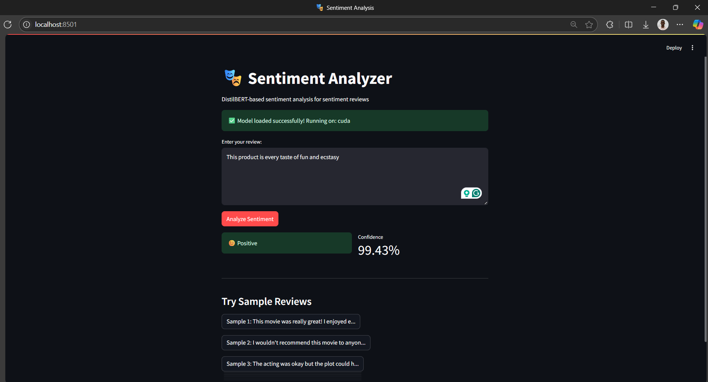
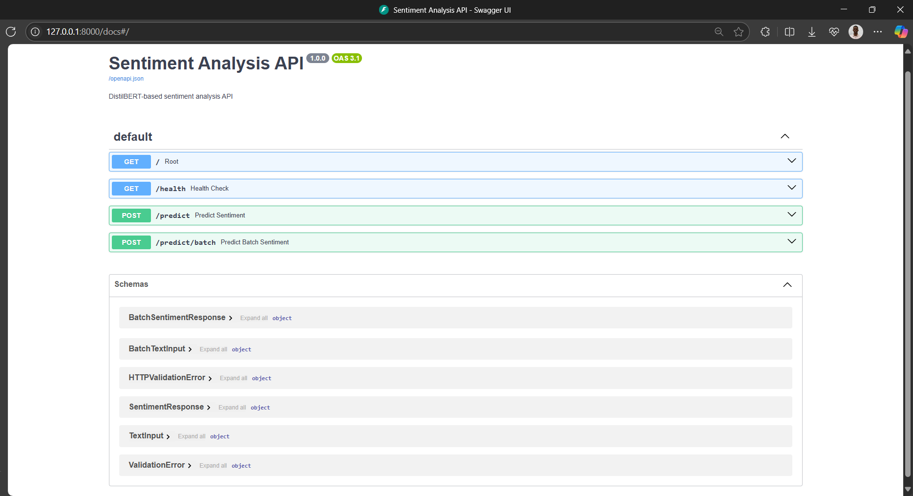

# Sentiment Analysis Project

This project analyses a user's reviews to determine their sentiment — positive, negative, or neutral — based on the context of the user's reviews. This analysis helps to understand customer feedback, identify product strengths and weaknesses, and improve the overall customer experience by providing actionable insights.

## Table of Contents

- [Introduction](#introduction)
- [Installation](#installation)
- [Dataset](#dataset)
- [Model](#model)
- [Training](#training)
- [Results and Performance](#results-and-performance)
- [Usage](#usage)
- [Deployment](#deployment)
- [Contributing](#contributing)
- [Acknowledgements](#acknowledgements)

## Introduction

Sentiment analysis is a natural language processing (NLP) task that involves determining the sentiment expressed in a piece of text. In this project, we use the DistilBERT model, and the Trainer class from HuggingFace to train a model that is able to classify reviews as positive, neutral or negative using the IMDB dataset as our training dataset.

## Installation

### Prerequisites

- Python 3.8 or higher
- [uv](https://docs.astral.sh/uv/) package manager (recommended for faster dependency management)

### Option 1: Using uv (Recommended)

```bash
# Install uv if you haven't already
curl -LsSf https://astral.sh/uv/install.sh | sh
# Or on Windows:
# powershell -c "irm https://astral.sh/uv/install.ps1 | iex"
# Or, if you prefer pip
pip install uv

# Clone the repository
git clone https://github.com/palaemezie/Sentiment-Analysis.git

# Navigate into the project directory
cd Sentiment-Analysis

# Create a virtual environment with uv
uv venv sentiment_env

# Activate the virtual environment
# On Windows
sentiment_env\Scripts\activate
# On macOS/Linux
source sentiment_env/bin/activate

# Install dependencies using uv (much faster than pip)
uv pip install -r requirements.txt

# Alternatively, install directly without activating venv
uv pip install -r requirements.txt --system
```

### Option 2: Traditional pip method

```bash
# Clone the repository
git clone https://github.com/palaemezie/Sentiment-Analysis.git

# Navigate into the project directory
cd Sentiment-Analysis

# Create a virtual environment
python -m venv sentiment_env

# Activate the virtual environment
# On Windows
sentiment_env\Scripts\activate
# On macOS/Linux
source sentiment_env/bin/activate

# Install dependencies
pip install -r requirements.txt
```

### Verify Installation

```bash
# Test the installation
python -c "import torch, transformers; print('✅ Installation successful!')"
```

## Dataset

The dataset used in this project is the IMDB movie review dataset. It contains 50,000 movie reviews labeled as either positive or negative. The dataset is included in the repository as `IMDB Dataset.csv`.

## Model

This project uses the DistilBERT model for sequence classification. DistilBERT is a smaller, faster, and cheaper version of BERT, making it suitable for this task while maintaining good performance.

## Training

The training process involves feeding the dataset into the model and optimizing it using backpropagation. Training parameters and configurations are specified in the notebook. The model parameters were frozen for these reasons:

1. **Faster Training**: Only the classifier layers train, so training is much faster
2. **Less Memory Usage**: Fewer parameters to update means lower GPU memory requirements
3. **Prevents Overfitting**: The pre-trained features are preserved, reducing risk of overfitting on small datasets
4. **Stable Features**: The base model's learned representations stay intact
5. **Good for Small Datasets**: When you have limited training data, freezing prevents destroying the pre-trained knowledge

## Results and Performance

The model achieved an evaluation accuracy of approximately **80.87%** on the test set on a single training cycle (epoch). Performance metrics include:

- **Loss**: 0.4140
- **Accuracy**: 80.82% (8,082 out of 10,000 test samples)
- **Training Time**: Approximately 3 minutes per epoch
- **Inference Speed**: ~58.7 samples/second

## Usage

### Streamlit Web Interface

After setting up the project, you can run the Streamlit app with the following command:

```bash
streamlit run sentiment_interface.py
```

This will launch the application in your web browser:

- **Local URL**: <http://localhost:8501>
- **Network URL**: <http://192.168.0.3:8501>

The web interface allows you to input reviews and visualize sentiment analysis results.



### API Usage

For programmatic access, you can use the prediction function directly:

```python
from sentiment_analysis import predict_sentiment

# Load your trained model and tokenizer
result = predict_sentiment(model, tokenizer, "This movie was amazing!")
print(result)  # {'text': '...', 'sentiment': 'positive', 'confidence': '92.34%'}
```

## Deployment

### FastAPI Deployment

This project includes a FastAPI deployment for production use with direct API calls:

```bash
# Start the FastAPI server
uvicorn app:app --reload
```

The API will be available at:

- **API Documentation**: <http://127.0.0.1:8000/docs>
- **Alternative docs**: <http://127.0.0.1:8000/redoc>



### API Endpoints

- `GET /health` - Health check endpoint
- `POST /predict` - Single text prediction
- `POST /predict/batch` - Batch text prediction

### Testing the API

You can test the API by running the test suite:

```bash
cd tests
python test_api.py
```

Or use curl for quick testing:

```bash
curl -X POST "http://localhost:8000/predict" \
     -H "Content-Type: application/json" \
     -d '{"text": "This movie was fantastic!"}' \
     --max-time 10
```

## Contributing

Contributions are welcome! Please follow these steps:

1. Fork the repository
2. Create a new feature branch (`git checkout -b feature-name`)
3. Commit your changes (`git commit -m 'Add some feature'`)
4. Push to the branch (`git push origin feature-name`)
5. Open a pull request

## Acknowledgements

This project uses the following libraries and resources:

- [Hugging Face Transformers](https://huggingface.co/transformers/)
- [IMDB Movie Review Dataset](https://ai.stanford.edu/~amaas/data/sentiment/)
- [PyTorch](https://pytorch.org/)
- [Scikit-learn](https://scikit-learn.org/)
- [FastAPI](https://fastapi.tiangolo.com/)
- [Streamlit](https://streamlit.io/)

Special thanks to the developers and contributors of these libraries for their excellent work.

## License

This project is licensed under the MIT License - see the [LICENSE](LICENSE) file for details.

## Support

If you encounter any issues or have questions, please:

1. Check the [Issues](https://github.com/palaemezie/Sentiment-Analysis/issues) page
2. Create a new issue if your problem isn't already reported
3. Provide detailed information about your environment and the error

---

**Note**: For the best experience, we recommend using `uv` for package management as it's significantly faster than traditional pip installations.
